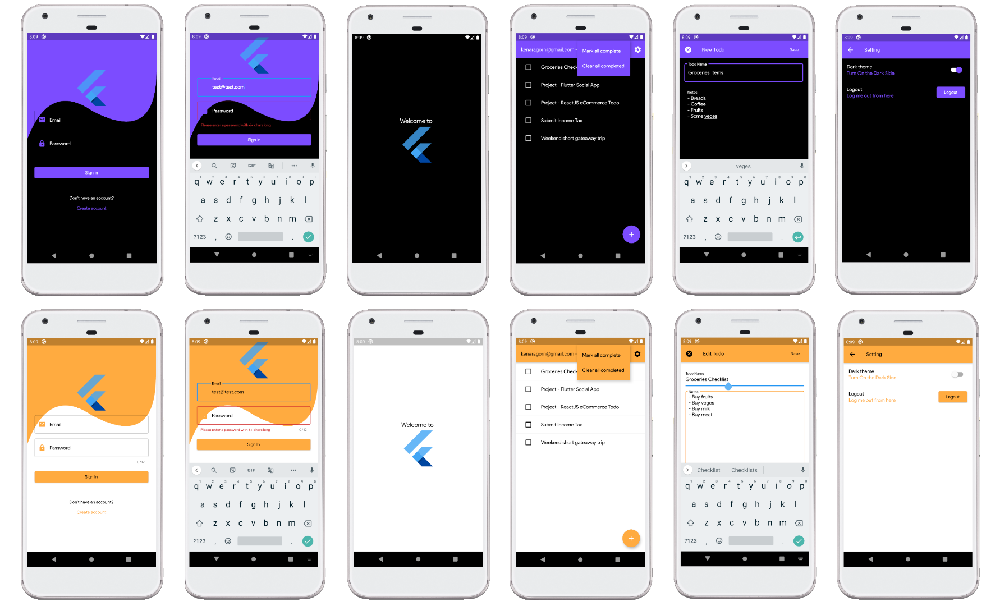
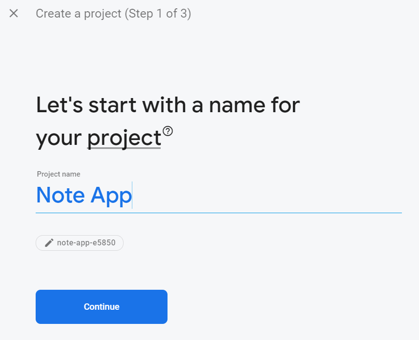
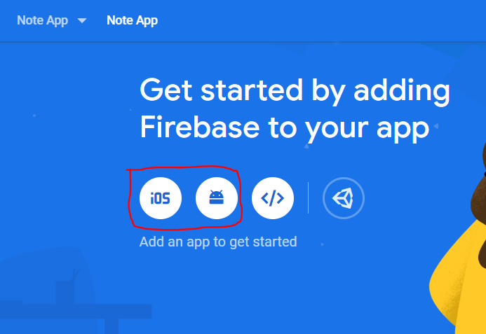
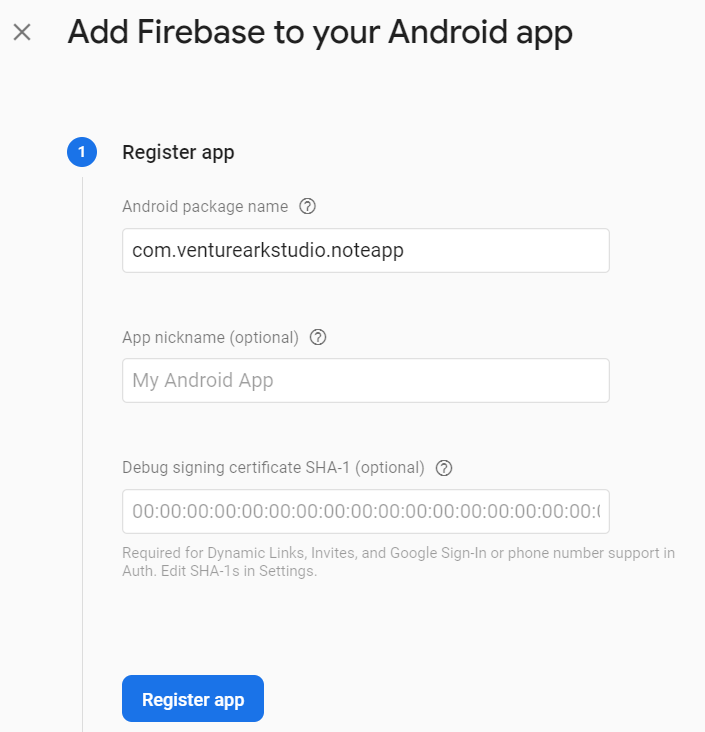
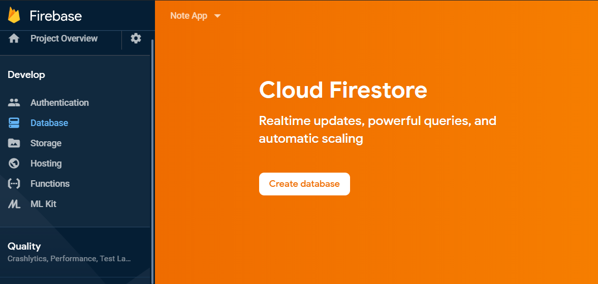
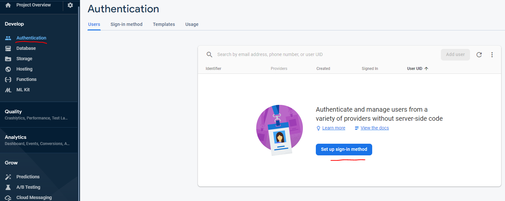

# Flutter Boilerplate Project using Provider with Firebase Authentication and Firestore

This is the **boilerplate project** for anyone that want to create **Flutter mobile application using Provider, Shared Preferences and Firebase**.


## Motivation

The project contains the minimal implementation required to create a new Flutter project using Provider for state management and Firebase as the backend connectivity for user authorisation control and Firestore for database.

The project come with preloaded folder structure recommended for Provider and separation of business logic, user interface and services needed for any Flutter Firebase project. Apart from that, it come with commonly used files and widgets such as app theme, constants and common Firebase code.

Instead of spending time in every new project to setup development structure, copy and paste, this will help in reducing the common code practise and structure, and quickly allow us to focus on the core part of the app, avoiding writing again and again the same code from scratch.


## Project Goals

The main goal is to define a reference architecture that can be used as the foundation for Flutter app that require the usage of Firebase and eventually:

- To reduce developer time in re-writing common code and project structure from scratch
- To have a common folder and package structure that can be further extended should it require
- Clearing define the app layer – UI layer, business logic layer and service layer

The 3 main layers:
- UI layer – all UI widgets files
- Business logic layer – contains all app business and presentation logic
- Service layer – contains services needed to interact with between the app and 3rd party services such as APIs

This project bundled with a demo app as a practical example of this architecture.


## Demo App: Todo App



The demo app demonstrates a simple but comprehensive enough to capture the various challenges and use cases of state management across multiple screens and different modules. 

After signed into the app, users can view, create, edit and delete their todo notes. User can change the theme and data is stored in Firebase Firestore.


## How to Use

### Step 1:
Download or clone this repo by using the following link:
[https://github.com/KenAragorn/create_flutter_provider_app.git](https://github.com/KenAragorn/create_flutter_provider_app.git)

### Step 2:
Go to your local extracted clone copy of the project, open the android/build.gradle file and change the applicationId to your own application ID. For example, com.your_com_name.project_name. 


### Step 3:
Go to the project root and execute the following command to get all dependencies packages:
```flutter pub get```

### Step 4:
Go to your [Firebase](https://console.firebase.google.com/) console. Create a new Firebase project. Once created without any issue, register your app by clicking the icon – for Android, click on the Android icon and for iOS, click on the iOS icon. Complete the rest of the step require.




### Step 5:
Ensure the Android package name is the same value as your application ID setup in step 2.


### Step 6:
Download the google-services.json file provided by Firebase to the android/app directory. Then, update the Gradle build files under android/build.gradle to register the app with Google services.


### Step 7:
Update the android/app/build.gradle file by adding the following highlighted code:


### Step 8:
Go back to your Firebase console to create the database Cloud Firestore. Choose the test mode option. You can change it later, just make sure to choose the nearer Cloud Firestore location nearer to your location.


### Step 9:
Still within Fiebase console, go to Authentication and turn on the sign-in method. In our case, that would be email/password have to turn on by setting the status to enabled. Other sign-in method will be added soon.


### Step 10:
Done. Try launch the app using emulator or your preferred physical test device. For first time user, you need to create a new account from the app. 


## Third Party Libraries Dependencies:

* [Provider](https://github.com/rrousselGit/provider)
* [Firebase Auth](https://pub.dev/packages/firebase_auth)
* [Cloud Firestore](https://pub.dev/packages/cloud_firestore)
* [Shared Preferences](https://pub.dev/packages/shared_preferences)
* [Flutter Platform Widgets](https://pub.dev/packages/flutter_platform_widgets)

## Project Key Features:

* Splash Screen
* New User Registration & Login - Firebase Auth - Email/Password only (more will be added soon)
* Routing – Separation of routing files for ease of maintenance
* Theme – Separation of theme files that support dark and light theme
* Provider – State management
* Caching – Using SharedPreferences to keep track theme selection


## Folder Structure: 
```
lib/
|- constants/ – contains all application level constants for theme, font types and app strings.
|- caches/ – contains data layer such as shared preferences.
|- models/ – contains all the plain data models.
|- services/ – contains all services files that handle the API calling for CRUD related functionalities.
|- providers/ – contains all Provider models for each of the widget views.
|- ui/ the main folder that will contains all UI related breaking down further by different modules (such as authentication, home, etc) and sub section (reusable widgets and screens).
|- routes.dart
|- auth_widget_builder.dart
|- main.dart
```

### What inside constants?
Basically, all needed constant files for the application to work will be here. 
```
constants/
|- app_themes.dart – the theme file for the app
|- app_font_family.dart – the app global supported font family
|- app_strings.dart – the strings value used by the app
```

### What inside cache?
As of now, only shared preferences files. In future we may have others such as sqlite features and it is good to keep things separated.
```
caches/
|- sharedpref/shared_preference_helper.dart
```

### What inside models?
All plain data models file will be here. Depending on the number of the model files, if it is more than 10 files, we suggest separating the files by sub folder such as models/auth, models/todo etc. Else, keep it simple with every data model file is within this folder.
```
models/
|- user_model.dart
|- todo_model.dart
```

### What inside services?
As we have backend firestore and firebase for application data such as user and todo data, we will need a dart classes that represent the CRUD services to handle any communication between the UI code and the backend. 
```
services/
|- firestore_database.dart
|- firestore_service.dart
|- firestore_path.dart
```

### What inside providers?
Contains all provider models needed for the app. The idea is like those in models and services in which, different provider class will be created for different key modules.
```
providers/
|- auth_provider.dart
|- theme_provider.dart
```

### What inside UI?
This directory contains all the UI files for the application. As most of the times, there will be more than 1 files representing a screen, thus is always good to separate it by sub-folder and grouping it based on their key features or modules. 
```
ui/
|- auth
        |- register_screen.dart
        |- sign_in_screen.dart
|- splash
        |- splash_screen.dart
|- home
        |- home.dart
|- todo
        |- todos_screen.dart
        |- create_edit_todo_screen.dart
```

## Use Case: Firestore Service
Any widgets module can subsribe to updates from Firebase Firestore through streams, as well as write operation such as creation and deletion of data using Future-based APIs.

For convenient, all Firestore related CRUD services for the demo app is all in 1 place:
```dart
class FirestoreDatabase { // implementation omitted for brevity
  Future<void> setTodo(TodoModel todo); // create / update
  Future<void> deleteTodo(TodoModel todo); // delete
  Stream<List<TodoModel>> todosStream(); // read
  Stream<Job> todoStream({@required String todoId}); // read
}
```

With this setup, creating a widget that shows a list of jobs becomes simple:
```dart
@override
Widget build(BuildContext context) {
  final database = Provider.of<FirestoreDatabase>(context, listen: false);
  return StreamBuilder<List<Job>>(
    stream: database.todosStream(),
    builder: (context, snapshot) {
      // TODO: return widget based on snapshot
    },
  );
}
```
Domain-level model classes are defined, along with `fromMap()` and `toMap()` methods for serialization.

### Note about stream-dependant services
When using Firestore, is quite common to organise user data inside documents or collections that depend on the unique user `uid`. 

When reading or writing data, the app need to access to the user `uid`. This can change at runtime, as user can log out and sign back in with a different account, which eventually a different `uid`.

This, the `FirestoreDatabase` takes the `uid` as a constructor parameter. So, the moment we have `FirebaseUser` upon user logged in, we can just pass the `uid` to the Firestore database when performing CRUD operations.

To achieve this, `FirestoreDatabase` will be re-created everytime `onAuthStateChanged` changed.

## Future Roadmap
* Additional Sign-in method - Google
* Separation of different build flavors
* Animation

## Conclusion
Again, take note, this is an example from my few mobile app projects, and instead of repeating the same process over and over again, I decided to spend some time to create this architecture that is easier to onboard for any new Flutter project that used Provider and Firebase.
If you liked my work, don’t forget to ⭐ star the repo to show your support.

## [License: MIT](LICENSE.md)


